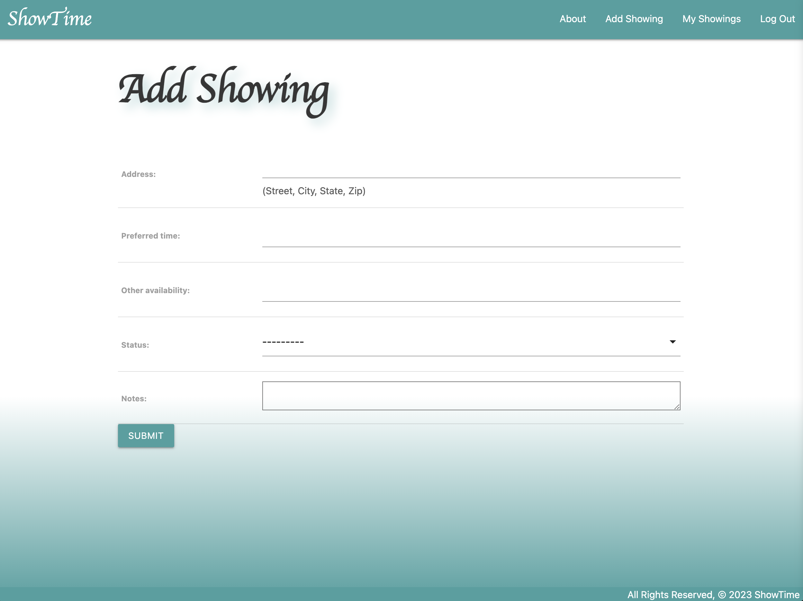

# ShowTime

## Summary

#### Realtors know days can be busy and chaotic. Clients will often request to tour properties without providing a full address and a time they'd like to see it. This has proven to be inefficient and a roadblock to the best possible homebuying experience. Have no fear - ShowTime provides a structured form that asks clients for all of the necessary information and organizes showings. It's ShowTime, baby!

#### Technologies Used: Python, Django, postgreSQL, HTML, CSS

#### Link to live site: (Please do not delete any data) https://jkshowtime-d3995c3eaf9b.herokuapp.com/

## Future Improvements

#### - Allow Realtor's to create their own accounts and see solely their clients' showings. Currently the site is only set up for one Realtor to access their showings through the admin page

#### - Allow Realtors to accept/deny showing requests

#### - Break down showings into categories. 1. Active 2. Pending 3. Completed 4.Denied

#### - Integrate an API that connects the property to the actual house listing and utilizes the photo

## Photos

